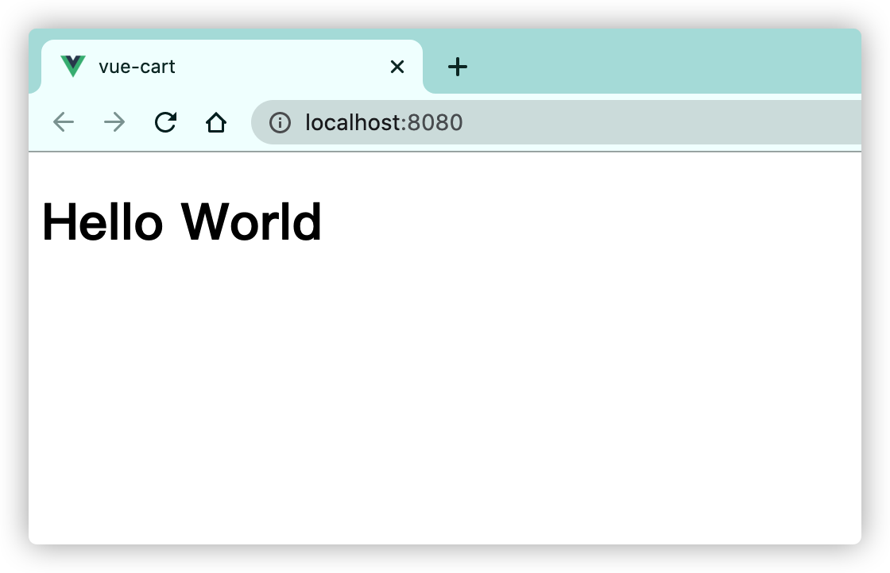
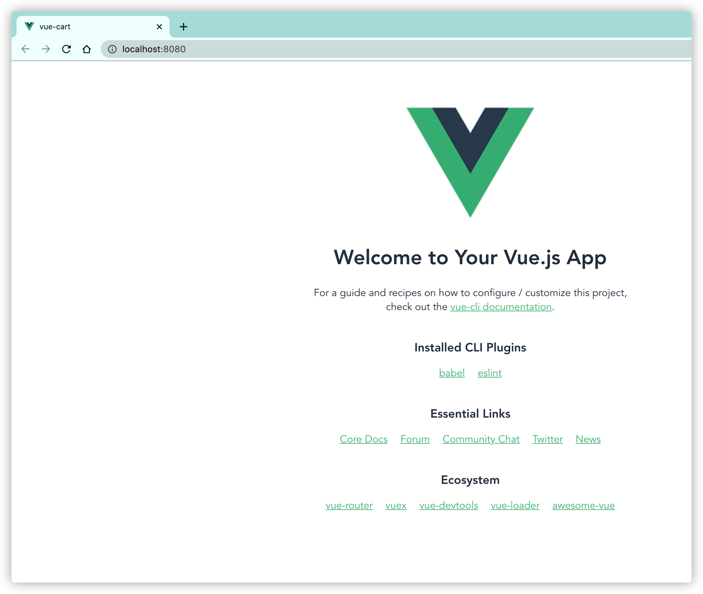
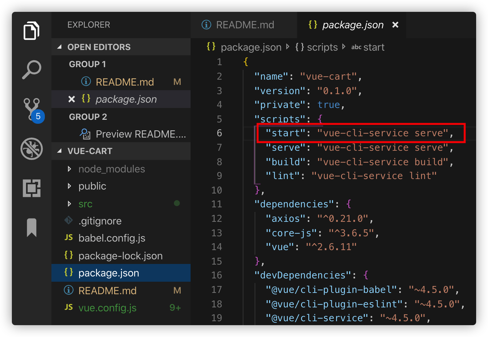

<!-- TOC -->

- [1. vue-cart](#1-vue-cart)
- [2. vue 官网](#2-vue-官网)
- [3. 安装 vue-cli](#3-安装-vue-cli)
- [4. 查看版本号](#4-查看版本号)
- [5. 单文件开发](#5-单文件开发)
  - [5.1. 创建单文件](#51-创建单文件)
  - [5.2. 运行](#52-运行)
  - [5.3. 效果](#53-效果)
- [6. 正式项目开发](#6-正式项目开发)
  - [6.1. 新建项目](#61-新建项目)
  - [6.2. 运行](#62-运行)
  - [6.3. 效果](#63-效果)
  - [6.4. 配置 npm start](#64-配置-npm-start)
  - [6.5. 语法](#65-语法)
    - [6.5.1. 条件语句 v-if](#651-条件语句-v-if)
    - [6.5.2. 循环语句 v-for](#652-循环语句-v-for)
    - [6.5.3. v-model 双向绑定与事件绑定@click](#653-v-model-双向绑定与事件绑定click)
  - [6.6. Project setup](#66-project-setup)
    - [6.6.1. Compiles and hot-reloads for development](#661-compiles-and-hot-reloads-for-development)
    - [6.6.2. Compiles and minifies for production](#662-compiles-and-minifies-for-production)
    - [6.6.3. Lints and fixes files](#663-lints-and-fixes-files)
    - [6.6.4. Customize configuration](#664-customize-configuration)

<!-- /TOC -->

# 1. vue-cart

vue 的基本使用，购物车小案例

# 2. vue 官网

http://cn.vuejs.org

http://cli.vuejs.org

# 3. 安装 vue-cli

```
npm install -g @vue/cli
npm install -g @vue/cli-service-gloal
```

# 4. 查看版本号

```
vue -V
```

# 5. 单文件开发

## 5.1. 创建单文件

single.vue

```html
<template>
  <div>
    <h1>{{message}}</h1>
  </div>
</template>

<script>
  export default {
    data() {
      return {
        message: "Hello World",
      };
    },
  };
</script>

<style lang="scss" scoped></style>
```

## 5.2. 运行

```
vue serve single.vue
```

## 5.3. 效果



# 6. 正式项目开发

## 6.1. 新建项目

```
vue create vue-cart
```

## 6.2. 运行

```
npm run serve
```

## 6.3. 效果



## 6.4. 配置 npm start


这样只要通过

```
npm start
```

就可以运行项目了

## 6.5. 语法

### 6.5.1. 条件语句 v-if

```html
<template>
  <div>
    <h1 v-if="isShow">{{message}}</h1>
  </div>
</template>

<script>
  export default {
    data() {
      return {
        message: "Hello World",
        isShow: false,
      };
    },
    created() {
      setTimeout(() => {
        this.isShow = true;
      }, 5000);
    },
  };
</script>

<style lang="scss" scoped></style>
```

### 6.5.2. 循环语句 v-for

```html
<template>
  <div>
    <table border="1">
      <tr v-for="g in goods" :key="g.id">
        <td>{{g.text}}</td>
        <td>{{g.price}}</td>
      </tr>
    </table>
  </div>
</template>

<script>
  export default {
    data() {
      return {
        goods: [
          { id: 1, text: "Java架构师", price: 100 },
          { id: 2, text: "前端架构师", price: 200 },
          { id: 3, text: "PHP架构师", price: 300 },
        ],
      };
    },
  };
</script>

<style lang="scss" scoped></style>
```

### 6.5.3. v-model 双向绑定与事件绑定@click

```html
<template>
  <div>
    id <input type="text" v-model="id" /> text
    <input type="text" v-model="text" />
    <input type="button" value="加入购物车" @click="addGood" />
    <div>{{text}}</div>
    <table border="1">
      <tr v-for="g in goods" :key="g.id">
        <td>{{g.text}}</td>
        <td>{{g.price}}</td>
      </tr>
    </table>
  </div>
</template>

<script>
  export default {
    data() {
      return {
        id: "",
        text: "",
        goods: [
          { id: 1, text: "Java架构师", price: 100 },
          { id: 2, text: "前端架构师", price: 200 },
          { id: 3, text: "PHP架构师", price: 300 },
        ],
      };
    },
    methods: {
      addGood() {
        this.goods.push({ id: this.id, text: this.text, price: 100 });
      },
    },
  };
</script>

<style lang="scss" scoped></style>
```

## 6.6. Project setup

```
npm install
```

### 6.6.1. Compiles and hot-reloads for development

```
npm run serve
```

### 6.6.2. Compiles and minifies for production

```
npm run build
```

### 6.6.3. Lints and fixes files

```
npm run lint
```

### 6.6.4. Customize configuration

See [Configuration Reference](https://cli.vuejs.org/config/).
