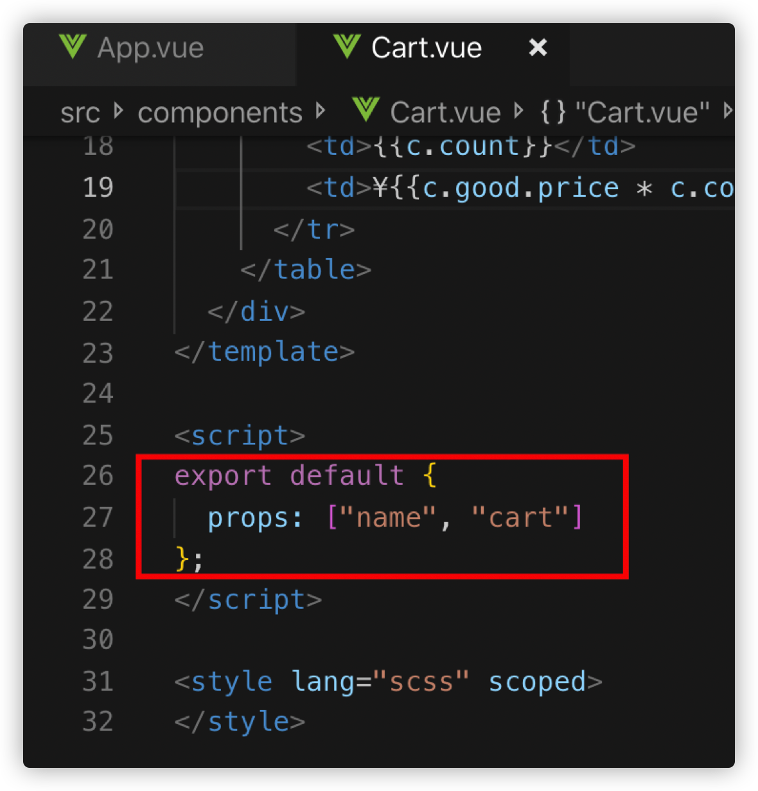
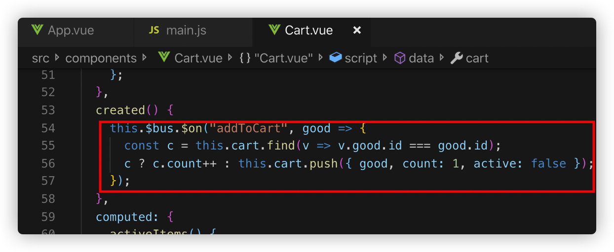
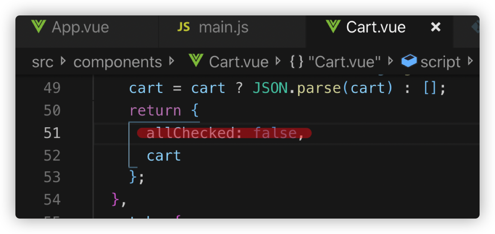

<!-- TOC -->

- [1. vue-cart](#1-vue-cart)
- [2. vue 官网](#2-vue-官网)
- [3. 安装 vue-cli](#3-安装-vue-cli)
- [4. 查看版本号](#4-查看版本号)
- [5. 单文件开发](#5-单文件开发)
  - [5.1. 创建单文件](#51-创建单文件)
  - [5.2. 运行](#52-运行)
  - [5.3. 效果](#53-效果)
- [6. 正式项目开发](#6-正式项目开发)
  - [6.1. 新建项目](#61-新建项目)
  - [6.2. 运行](#62-运行)
  - [6.3. 效果](#63-效果)
  - [6.4. 配置 npm start](#64-配置-npm-start)
  - [6.5. 语法](#65-语法)
    - [6.5.1. 条件语句 v-if](#651-条件语句-v-if)
    - [6.5.2. 循环语句 v-for](#652-循环语句-v-for)
    - [6.5.3. v-model 双向绑定与事件绑定@click](#653-v-model-双向绑定与事件绑定click)
- [7. 组件开发购物车案例](#7-组件开发购物车案例)
  - [7.1. 新建购物车组件](#71-新建购物车组件)
  - [7.2. 使用组件](#72-使用组件)
  - [7.3. 父组件给子组件传值](#73-父组件给子组件传值)
  - [7.4. 子组件接收传值](#74-子组件接收传值)
  - [7.5. 加入购物车功能](#75-加入购物车功能)
  - [7.6. 购物车的全选全不选](#76-购物车的全选全不选)
  - [7.7. 计算属性](#77-计算属性)
  - [7.8. 删除功能](#78-删除功能)
  - [7.9. 总线模式](#79-总线模式)
  - [7.10. 数据模拟 mock](#710-数据模拟-mock)
  - [7.11. css 样式](#711-css-样式)
  - [7.12. 数据持久化](#712-数据持久化)
  - [7.13. 效果](#713-效果)

<!-- /TOC -->

# 1. vue-cart

vue 的基本使用，购物车小案例

# 2. vue 官网

http://cn.vuejs.org

http://cli.vuejs.org

# 3. 安装 vue-cli

```
npm install -g @vue/cli
npm install -g @vue/cli-service-gloal
```

# 4. 查看版本号

```
vue -V
```

# 5. 单文件开发

## 5.1. 创建单文件

single.vue

```html
<template>
  <div>
    <h1>{{message}}</h1>
  </div>
</template>

<script>
  export default {
    data() {
      return {
        message: "Hello World",
      };
    },
  };
</script>

<style lang="scss" scoped></style>
```

## 5.2. 运行

```
vue serve single.vue
```

## 5.3. 效果


# 6. 正式项目开发

## 6.1. 新建项目

```
vue create vue-cart
```

## 6.2. 运行

```
npm run serve
```

## 6.3. 效果


## 6.4. 配置 npm start


这样只要通过

```
npm start
```

就可以运行项目了

## 6.5. 语法

### 6.5.1. 条件语句 v-if

```html
<template>
  <div>
    <h1 v-if="isShow">{{message}}</h1>
  </div>
</template>

<script>
  export default {
    data() {
      return {
        message: "Hello World",
        isShow: false,
      };
    },
    created() {
      setTimeout(() => {
        this.isShow = true;
      }, 5000);
    },
  };
</script>

<style lang="scss" scoped></style>
```

### 6.5.2. 循环语句 v-for

```html
<template>
  <div>
    <table border="1">
      <tr v-for="g in goods" :key="g.id">
        <td>{{g.text}}</td>
        <td>{{g.price}}</td>
      </tr>
    </table>
  </div>
</template>

<script>
  export default {
    data() {
      return {
        goods: [
          { id: 1, text: "Java架构师", price: 100 },
          { id: 2, text: "前端架构师", price: 200 },
          { id: 3, text: "PHP架构师", price: 300 },
        ],
      };
    },
  };
</script>

<style lang="scss" scoped></style>
```

### 6.5.3. v-model 双向绑定与事件绑定@click

```html
<template>
  <div>
    id <input type="text" v-model="id" /> text
    <input type="text" v-model="text" />
    <input type="button" value="加入购物车" @click="addGood" />
    <div>{{text}}</div>
    <table border="1">
      <tr v-for="g in goods" :key="g.id">
        <td>{{g.text}}</td>
        <td>{{g.price}}</td>
      </tr>
    </table>
  </div>
</template>

<script>
  export default {
    data() {
      return {
        id: "",
        text: "",
        goods: [
          { id: 1, text: "Java架构师", price: 100 },
          { id: 2, text: "前端架构师", price: 200 },
          { id: 3, text: "PHP架构师", price: 300 },
        ],
      };
    },
    methods: {
      addGood() {
        this.goods.push({ id: this.id, text: this.text, price: 100 });
      },
    },
  };
</script>

<style lang="scss" scoped></style>
```

# 7. 组件开发购物车案例

## 7.1. 新建购物车组件


## 7.2. 使用组件


## 7.3. 父组件给子组件传值


## 7.4. 子组件接收传值



## 7.5. 加入购物车功能


把 good 整体放入购物车而不是把 good 属性展开放入有一个好处，就是当将来当商品列表中 good 的属性发生变化时，购物车中的数据能同步变化，比如管理员在后台更改了商品单价，用户看到自己的购物车中商品单价也同步修改了。


## 7.6. 购物车的全选全不选


## 7.7. 计算属性


## 7.8. 删除功能


## 7.9. 总线模式

加入购物这个功能是属于购物车组件的，应该放在 Cart.vue 中，但是用户点击商品上添加购物车的按钮这个行为是在商品列表上，也就是在父组件上。此时可以通过父组件派发事件，子组件监听事件来实现，这样降低了父子组件间的耦合度，使组件的复用性更强。

引入子组件时不再需要给子组件传递购物车数据

子组件也不用接收

cart 数据属于购物车组件，在购物车组件中添加 cart

加入购物车时，父组件派发一个事件，将要添加的商品作为参数

子组件监听到事件，进行自己的内部逻辑，达到了父子组件解耦合的效果

需要说明的是，这里即使不用总线 this.$bus也是可以的，可以用this.$root 拿到最顶级的 vue 对象，通过这个顶级对象进行事件的派发和监听。使用总线模式是为了逻辑上更为清晰，专门用一个对象进行事件的派发和监听。

## 7.10. 数据模拟 mock

配置文件

安装 axios

导入

使用


## 7.11. css 样式


## 7.12. 数据持久化

通过浏览器的 localStorage 持久化数据


想一想除了加入购物车需要持久化外还有哪些地方需要持久化？删除是不是也需要，购物车里商品的勾选状态是不是也需要，将来说不定还有等等一系列的行为需要做持久化，所以这么写很容易漏掉一些东西。我们可以想想我们需要持久化的是什么东西，我们需要持久化的是购物车数据，那为什么不只关注数据本身，用数据来驱动持久化，而不是行为来驱动，实际上这也是 vue 的设计思想之一。vue 给我们也提供了这样一种解决方案——watch

deep 可以实现对象的深层监听。
allChecked 不在监听的范围，我们需要把它放到 cart 里面，下面来重构一下



## 7.13. 效果


